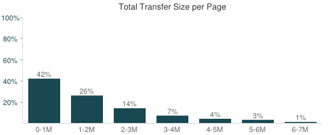
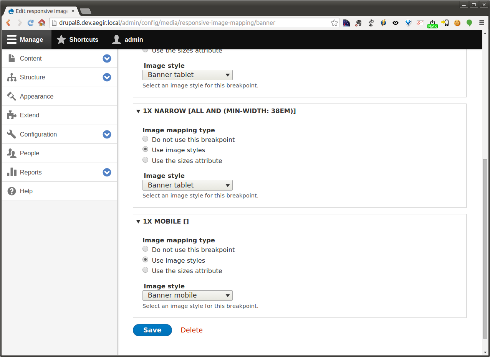

# Responsive images
and breakpoints
<!-- .slide: data-background="images/background.jpg" -->

[Peter Droogmans](https://drupal.org/u/attiks)  
[@attiks](https://twitter.com/attiks)

Note: Hello all and welcome


## About me
<!-- .slide: data-background="#232323" -->

- Long time (2008) Drupal developer
- Build lots of modules
- Worked on Drupal 6, 7, 8 core
- Member of RICG


## A bit of history


### Drupal 7 version(s)

- [Breakpoints module](https://www,drupal.org/project/breakpoints)
- [Picture 7.x-2.x module](https://www,drupal.org/project/picture)


### The evolution of the picture tag

- Started with scrset
- First try in 2012
- Second try end of 2013
- First implementation spring 2014
- Widely available automn 2014
- Now supported by Firefox, Chrome and Opera
- Spartan is adding support for srcset


### The polyfill

- https://github.com/scottjehl/picturefill


### When to use responsive images

- different sizes <!-- .element: class="fragment" -->
- dpi (retina) <!-- .element: class="fragment" -->
- different mime types <!-- .element: class="fragment" -->
- art direction <!-- .element: class="fragment" -->


### When not to use picture

- small logo <!-- .element: class="fragment" -->
- avatars <!-- .element: class="fragment" -->
- ads <!-- .element: class="fragment" -->
- svg <!-- .element: class="fragment" -->


## Why a new HTML tag and attribute

- ```<picture>```
- ``````


### Why do we need this

- Bandwidth <!-- .element: class="fragment" -->
- Performance <!-- .element: class="fragment" -->
- Art direction <!-- .element: class="fragment" -->


### Bandwidth

- Average page size: 2MB
- Average image size: 1.1MB


Source: [HTTP Archive - Top 1000 sites - April 1st 2015](http://httparchive.org/interesting.php?a=All&l=Apr%201%202015&s=Top1000)


### Bandwidth

- Downloading a 1MB takes almost 6 seconds on a good 3G connection
- Downloading a 6MB takes almost 50 seconds on a good 3G connection



Source: [HTTP Archive - Top 1000 sites - April 1st 2015](http://httparchive.org/interesting.php?a=All&l=Apr%201%202015&s=Top1000)


### Bandwidth waste


> At 360px, the average site would drop 436.08kb

Source: [Why We Need Responsive Images](http://timkadlec.com/2013/06/why-we-need-responsive-images/)


### Performance

- Google scores fast sites higher
- A lot of people only use a mobile device


### Art direction

- Use different cropping depending on the device
- Use a different image for print: ``` <source media="print" srcset="print.jpg"> ```


### Art direction example - wide


### Art direction example - bad


### Art direction example - good


## Breakpoints

Also known as media queries, used to define when your layout has to been
altered.

- Breakpoints used for the layout (grid) in your theme <!-- .element: class="fragment" -->
- Breakpoints used for inline content <!-- .element: class="fragment" -->


## Breakpoints for layout

Defined in demotheme.breakpoints.yml, and there're corresponding breakpoints 
inside your sass, css as well.


### layout.css - mobile

```
.page {
  width: 100%;
  max-width: 60em;
  margin: 0 auto;
}

.region-header,
.region-content,
.region-sidebar {
  width: 100%;
}

.container-main {
  display: flex;
  flex-direction: row;
  flex-wrap: wrap;
}

.region-sidebar {
  flex: 1 1 100%;
  order: 1;
}

.region-content {
  flex: 1 1 100%;
  order: 2;
}

.block-1 {
  display: none;
}
```


### layout.css - tablet

```
@media all and (min-width: 38em) {
  /* 608px */
  .block-1 {
    display: block;
  }

  .region-sidebar {
    flex: 0 0 15em;
    order: 1;
    margin-right: 1em;
  }

  .region-content {
    flex: 1 14em;
    order: 2;
  }
}
```


### layout.css - desk

```
@media all and (min-width: 50em) {
  /* 50em ~ 608px */
  /* Nothing needed for the layout */
}
```


### demotheme.breakpoints.yml

Ordered from largest (most specific) to smallest (least specific)

```
demotheme.mobile:
  label: mobile
  mediaQuery: ''
  weight: 2
  multipliers:
    - 1x
demotheme.narrow:
  label: narrow
  mediaQuery: 'all and (min-width: 38em)'
  weight: 1
  multipliers:
    - 1x
demotheme.wide:
  label: wide
  mediaQuery: 'all and (min-width: 50em)'
  weight: 0
  multipliers:
    - 1x
```

Note: Add a mobile, empty breakpoint to be able to use sizes later.


### Mobile


### Tablet


### Desk


## Breakpoints used for inline content

Also defined in theme.breakpoints.yml, but not necessarily used by your
sass or css.


### style.css - desk

```
@media all and (min-width: 50em) {
  /* 50em ~ 608px */
  .field-node--field-image {
    float: left;
    padding: 0 1em 1em 0;
  }
}
```


### Mobile

- Smaller banner image (240 * 90)
- Content image full width (240 * 140)


Note: We need the following image styles

- Banner mobile: Scale and crop 540x200
- Content mobile: Scale width 608


### Tablet

- Same banner image (170 * 140)
- Content image full width (240 * 140)


Note: We need the following image styles

- Banner tablet: Scale and crop 170x140
- Content tablet: Scale width 800


### Desk

- Banner image (170 * 140)
- Content image wrapped by text (180 * 105)


Note: We need the following image styles

- Content tablet: Scale width 180


## Responsive image mappings


### Why do we need this

- To control output <!-- .element: class="fragment" -->
- Connect breakpoint, sizes and image style <!-- .element: class="fragment" -->


### Responsive image mapping

1. Enter name and select theme (or breakpoint group)
2. Select image styles
3. Save


Content: Add responsive image mapping


Content: Enter a name and select a group  


Content: Select image styles  


Content: Select image styles  


Banner: Enter a name and select a group  


Banner: Select image styles  


Banner: Select image styles  



## Banner block view

1. Edit view
2. Change image formatter
3. Save


## Banner: edit the view


## Banner: formatter and mapping


## Content: field formatter

1. Select formatter
2. Configure formatter
3. Save


Content: select mapping  


## Problems

- Banner image between mobile and tablet breakpoint <!-- .element: class="fragment" -->
- Content image between mobile and tablet breakpoint <!-- .element: class="fragment" -->
- Content image between tablet and desktop breakpoint <!-- .element: class="fragment" -->


## Possible solutions

- Old school: add more breakpoints <!-- .element: class="fragment" -->
- New school: use sizes <!-- .element: class="fragment" -->

Note: Adding breakpoints works, but is tedious


## Add sizes to banner mapping


## Change the settings in the view


## Add sizes to content mapping


Note: We use *(min-width: 38em) 70vw, 100vw* to avoid having to repeat
ourself for the tablet breakpoint.


## Add sizes to content mapping


## Change the settings in manage display


# Theme and config files

Themers can do a lot of the preparation

- Define breakpoints in demotheme.breakpoints.yml <!-- .element: class="fragment" -->
- Define image styles in config/install/ <!-- .element: class="fragment" -->
- Define responsive image mappings in config/install/ <!-- .element: class="fragment" -->

 <!-- .element: class="fragment" -->


# Warnings


## Set a maximum width when using sizes

Example: ```(min-width: 80em) 424px, 50vw```

If you don't, huge images will be loaded on a big screen.


## Avoid art direction if you can


## The browser decides wich image to load

> Blink will now never upscale on 1x screens, where the resulting blur is especially noticeable. But it’ll upscale freely (using the aforementioned geometric mean) on HiDPI displays. To my eyes, a 1.5x image on a 2x screen looks fine, but a 0.75x image on a 1x screen looks bad, so this seems reasonable.

Source: [RICG Newsletter](http://us8.campaign-archive2.com/?u=c988d9ca55d5d09e73a7dc993&id=101078bbb3&e=e6e1658c5b)


# Tips

- Use chrome dev tools to simulate device and *network*
- Use [Googles Mobile-Friendly Test](https://www.google.com/webmasters/tools/mobile-friendly/?url=https%3A%2F%2Fattiks.com%2Fproject%2Fbreadgarden)
- Use [Googles PageSpeed Insights](https://developers.google.com/speed/pagespeed/insights/?url=https%3A%2F%2Fattiks.com%2Fproject%2Fbreadgarden)
- Use sizes whenever possible
- [Pick the right sizes](https://mattwilcox.net/web-development/keeping-srcset-and-sizes-under-control)


# The future

[Client Hints and Content Negotiation](https://github.com/igrigorik/http-client-hints)

```

```

```
GET /img.jpg HTTP/1.1
User-Agent: Awesome Browser
Accept: image/webp, image/jpg
DPR: 2.0
RW: 160
```


# The future

[Element queries](http://responsiveimagescg.github.io/eq-usecases/)

```
.widget-name {
    padding: 25px;
}
.widget-name[max-width="200px"] {
    padding: 0;
}
.widget-name[min-width="500px"] {
    padding: 55px;
}
```

Source: [Polyfill](https://github.com/marcj/css-element-queries)


# Drupal 8 issues

- [[Meta] Remove Picture polyfill updated](https://www.drupal.org/node/2343351)
- [UI changes to support current responsive image standards](https://www.drupal.org/node/2334387)
- [Improve DX of responsive images; convert theme functions to new #type element](https://www.drupal.org/node/2123251)


# Interesting readings

- [Why sizes and srcset](http://ericportis.com/posts/2014/srcset-sizes/)
- [Draft of the spec](http://picture.responsiveimages.org/)
- [Formal spec](http://www.whatwg.org/specs/web-apps/current-work/multipage/edits.html#embedded-content)
- [Browser support](http://status.modern.ie/pictureelement)
- [Can I use picture](http://caniuse.com/#feat=picture)
- [Polyfill](http://scottjehl.github.io/picturefill/)
- [Sizer Soze tool](https://github.com/yoavweiss/Sizer-Soze)
- [Picture use cases](http://www.smashingmagazine.com/2014/05/14/responsive-images-done-right-guide-picture-srcset/)
- [Opera article](http://dev.opera.com/articles/responsive-images)
- [To picturefill](http://filamentgroup.com/lab/to-picturefill.html)
- [Responsive Images 101](http://blog.cloudfour.com/responsive-images-101-definitions/)
- [Yoav Weiss](http://yoavweiss.github.io/smashingconf_oxford)


# The end

Thanks to

- Jelle Sebreghts [@sebreghtsjelle](https://twitter.com/sebreghtsjelle)
- Marc Drummond [@MarcDrummond](https://twitter.com/MarcDrummond)
- [Responsive Images Community Group](http://responsiveimages.org/)
  - [Members](https://github.com/orgs/ResponsiveImagesCG/members)
- [Filament Group](http://filamentgroup.com/)
  - Scott Jehl [@scottjehl](https://twitter.com/scottjehl)
  - Mat Marquis [@wilto](https://twitter.com/wilto)
- [Yoav Weiss](https://twitter.com/yoavweiss)
- [Marcos Caceres](https://twitter.com/marcosc)
